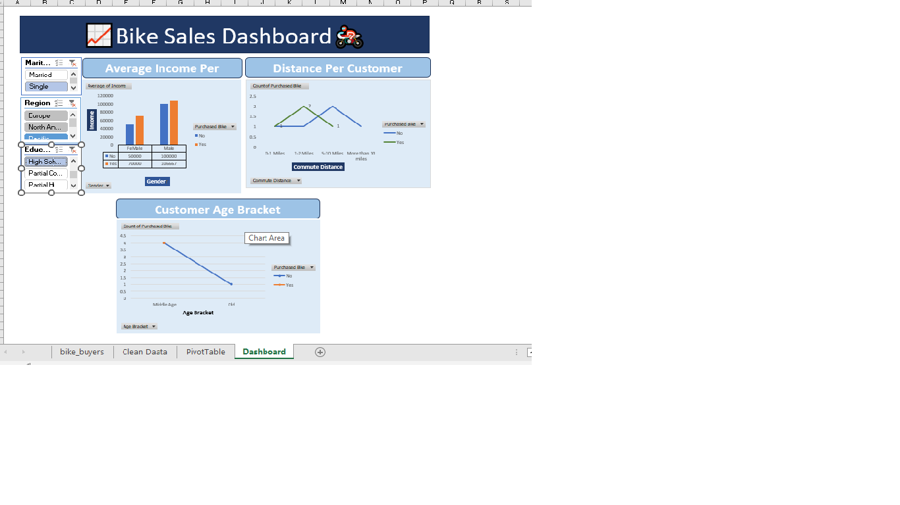

# 📊 Sales Dashboard using Microsoft Excel

This project is a professional **Sales Dashboard built in Microsoft Excel**, designed to analyze and visualize sales data in a clear, interactive, and user-friendly way.

---

## 🔍 Project Overview

The dashboard provides insights into:
- Total sales performance
- Sales by country/region
- Yearly and monthly trends
- Comparative analysis using charts
- Clean and professional dashboard layout

This project is ideal for **data analytics beginners**, students, and business reporting demonstrations.

---

## 🛠 Tools & Technologies Used

- **Microsoft Excel**
- Pivot Tables
- Charts & Graphs
- Data Cleaning
- Dashboard Design Principles

---

## 📁 Project Files

| File Name | Description |
|----------|------------|
| `sales dashboard final.xlsx` | Final interactive Excel dashboard |

---

## 🎯 Key Features

- 📌 Interactive visuals  
- 📌 Easy-to-understand layout  
- 📌 Business-ready dashboard  
- 📌 Clean and structured data presentation  

---

## 🚀 How to Use

1. Download the Excel file from this repository  
2. Open it using **Microsoft Excel (2016 or later recommended)**  
3. Explore charts, tables, and dashboard insights  

---

## 📸 Dashboard Preview

---

## 👤 Author

**SK Hassan Imam Nayeem**  
- Student & Data Analytics Enthusiast  
- Excel | Data Visualization | Dashboard Design  

---

## 📜 License

This project is created for **educational and personal use**.
